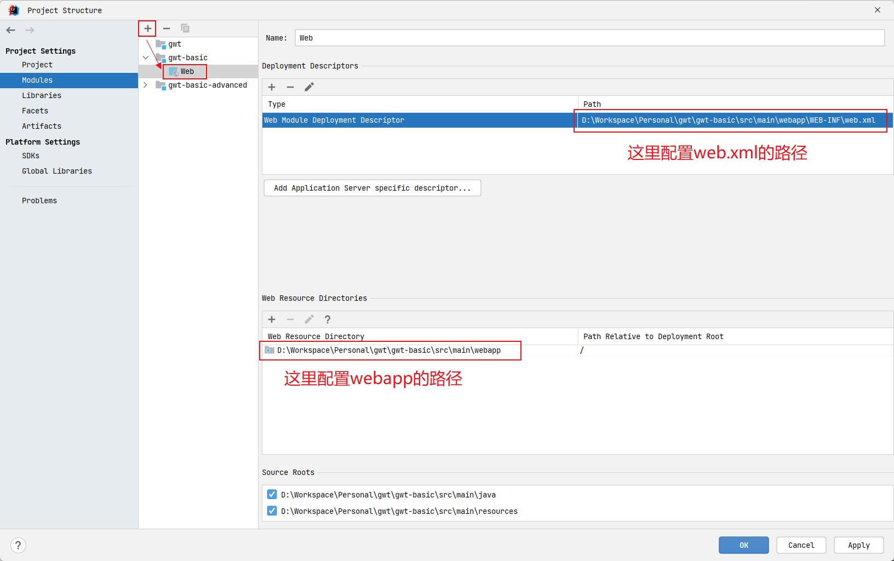
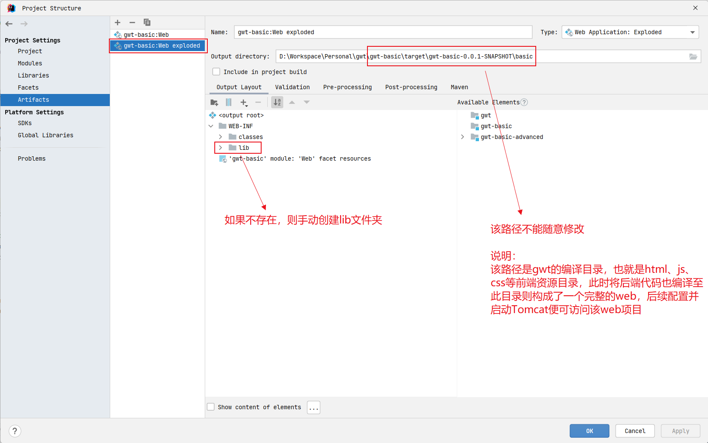
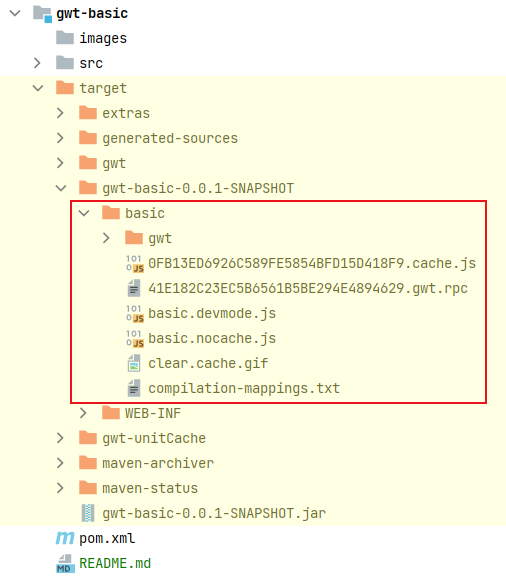
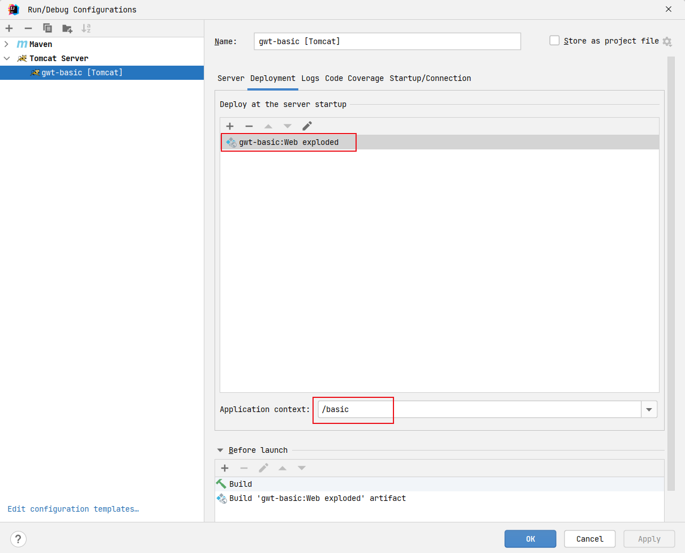
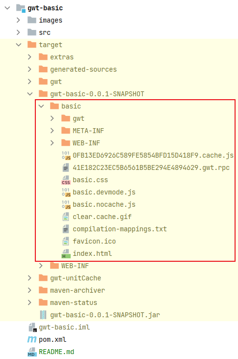
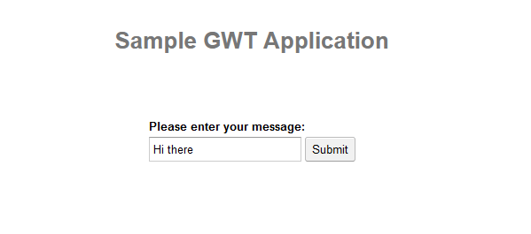
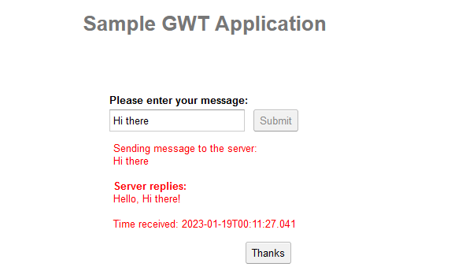

# Run Project

## 1. Configuration Java Web on IDEA




## 2. Compile GWT

```
cd {project.basedir}/gwt-basic
mvn verify
```



## 3. Configuration Tomcat



## 4. Run Tomcat

```
Connected to the target VM, address: '127.0.0.1:64151', transport: 'socket'

省略...

19-Jan-2023 00:04:55.615 信息 [main] org.apache.catalina.core.AprLifecycleListener.lifecycleEvent 使用APR版本[1.7.0]加载了基于APR的Apache Tomcat本机库[1.2.35]。
19-Jan-2023 00:04:55.615 信息 [main] org.apache.catalina.core.AprLifecycleListener.lifecycleEvent APR功能：IPv6[true]、sendfile[true]、accept filters[false]、random[true]、UDS [{4}]。
19-Jan-2023 00:04:55.615 信息 [main] org.apache.catalina.core.AprLifecycleListener.lifecycleEvent APR/OpenSSL配置：useAprConnector[false]，useOpenSSL[true]
19-Jan-2023 00:04:55.620 信息 [main] org.apache.catalina.core.AprLifecycleListener.initializeSSL OpenSSL成功初始化 [OpenSSL 1.1.1q  5 Jul 2022]
19-Jan-2023 00:04:55.745 信息 [main] org.apache.coyote.AbstractProtocol.init 初始化协议处理器 ["http-nio-8080"]
19-Jan-2023 00:04:55.767 信息 [main] org.apache.catalina.startup.Catalina.load Initialization processed in 591 ms
19-Jan-2023 00:04:55.809 信息 [main] org.apache.catalina.core.StandardService.startInternal 正在启动服务[Catalina]
19-Jan-2023 00:04:55.809 信息 [main] org.apache.catalina.core.StandardEngine.startInternal 正在启动 Servlet 引擎：[Apache Tomcat/8.5.84]
19-Jan-2023 00:04:55.835 信息 [main] org.apache.coyote.AbstractProtocol.start 开始协议处理句柄["http-nio-8080"]
19-Jan-2023 00:04:55.857 信息 [main] org.apache.catalina.startup.Catalina.start Server startup in 90 ms
Connected to server
[2023-01-19 12:04:56,193] Artifact gwt-basic:war exploded: Artifact is being deployed, please wait...
19-Jan-2023 00:05:03.219 信息 [RMI TCP Connection(3)-127.0.0.1] org.apache.jasper.servlet.TldScanner.scanJars 至少有一个JAR被扫描用于TLD但尚未包含TLD。 为此记录器启用调试日志记录，以获取已扫描但未在其中找到TLD的完整JAR列表。 在扫描期间跳过不需要的JAR可以缩短启动时间和JSP编译时间。
19-Jan-2023 00:05:03.282 信息 [RMI TCP Connection(3)-127.0.0.1] org.apache.jasper.servlet.TldScanner.scanJars 至少有一个JAR被扫描用于TLD但尚未包含TLD。 为此记录器启用调试日志记录，以获取已扫描但未在其中找到TLD的完整JAR列表。 在扫描期间跳过不需要的JAR可以缩短启动时间和JSP编译时间。
[2023-01-19 12:05:03,705] Artifact gwt-basic:war exploded: Artifact is deployed successfully
[2023-01-19 12:05:03,705] Artifact gwt-basic:war exploded: Deploy took 7,512 milliseconds
19-Jan-2023 00:05:05.843 信息 [localhost-startStop-1] org.apache.catalina.startup.HostConfig.deployDirectory 把web 应用程序部署到目录 [D:\Software\apache-tomcat-8.5.84\webapps\manager]
19-Jan-2023 00:05:05.938 信息 [localhost-startStop-1] org.apache.jasper.servlet.TldScanner.scanJars 至少有一个JAR被扫描用于TLD但尚未包含TLD。 为此记录器启用调试日志记录，以获取已扫描但未在其中找到TLD的完整JAR列表。 在扫描期间跳过不需要的JAR可以缩短启动时间和JSP编译时间。
19-Jan-2023 00:05:05.951 信息 [localhost-startStop-1] org.apache.catalina.startup.HostConfig.deployDirectory Web应用程序目录[D:\Software\apache-tomcat-8.5.84\webapps\manager]的部署已在[107]毫秒内完成
```



## 5. Visit Project

```
http://localhost:8080/basic/
```



